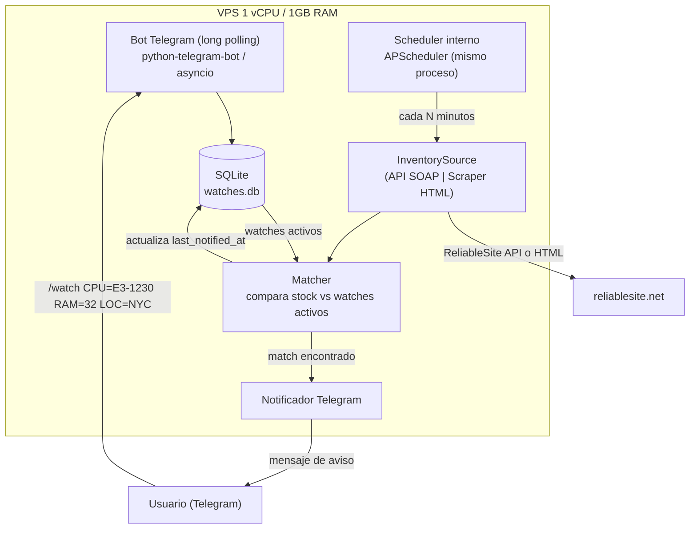

# SPECS.md — Monitor de disponibilidad de servidores dedicados en ReliableSite.net

## 1. Objetivo

Sistema que corre en una VPS de **1 vCPU / 1 GB RAM** que:

1. El usuario le "pide" un servidor dedicado con ciertas características (CPU, RAM, almacenamiento, ubicación, precio máximo) hablándole a un **bot de Telegram**.
2. El sistema consulta periódicamente la disponibilidad en **ReliableSite.net**.
3. Cuando encuentra una coincidencia, avisa al usuario por Telegram al instante.

Diseñado para correr 24/7 con un footprint de memoria muy bajo, sin navegador headless, sin base de datos externa y con un solo proceso persistente.

---

## 2. Restricciones de la VPS y decisiones derivadas

| Restricción | Decisión de diseño |
|---|---|
| 1 vCPU | Un solo proceso Python asíncrono (asyncio), sin workers paralelos ni Celery/Redis. |
| 1 GB RAM | Nada de Selenium/Playwright/Chromium (cada uno consume 300–500 MB+). Solo HTTP + parsing HTML ligero. SQLite en vez de Postgres/MySQL. |
| Sin garantía de dominio/HTTPS público | Bot de Telegram en modo **long polling**, no webhook (evita nginx + certbot + puerto abierto). |
| Presupuesto/operación mínima | Todo en un único servicio `systemd`, logs rotados localmente, sin stack de monitoreo externo. |

**Recomendación obligatoria de infraestructura:** crear un **swap file de 1–2 GB** en la VPS. Con solo 1 GB de RAM, cualquier `apt upgrade` o instalación de dependencias puede hacer OOM-kill sin swap, aunque el bot en sí consuma poco.

```bash
sudo fallocate -l 2G /swapfile
sudo chmod 600 /swapfile
sudo mkswap /swapfile
sudo swapon /swapfile
echo '/swapfile none swap sw 0 0' | sudo tee -a /etc/fstab
```

---

## 3. Fuente de datos: ReliableSite

ReliableSite ofrece una **API oficial de inventario** pensada exactamente para este caso de uso (revendedores/integradores que muestran stock en tiempo real). Se diseña como **método principal**, con **scraping como plan B**.

### 3.1 Método principal — Inventory API (SOAP/WCF)

- WSDL: `http://api.reliablesite.net/inventory.svc?wsdl`
- Protocolo: SOAP sobre WCF (Windows Communication Foundation), consumible desde cualquier lenguaje.
- Portal de artículos: `http://api.reliablesite.net/`
- Documentación de referencia:
  - [Getting Started with the Inventory API](https://support.reliablesite.net/kb/a251/getting-started-with-the-inventory-api.aspx)
  - [Accessing the Inventory API with PHP](https://support.reliablesite.net/kb/a250/accessing-the-inventory-api-with-_net.aspx)
  - [Accessing the Dedicated Server API](https://support.reliablesite.net/kb/a298/accessing-the-dedicated-server-api.aspx)
  - [ReliableSite Dedicated Hosting API — anuncio](https://www.reliablesite.net/hosting-news/dedicated-server-api/)

**Acción requerida antes de implementar:** pedir credenciales/acceso a la API contactando al soporte de ReliableSite (es un servicio pensado para clientes/resellers, no es totalmente público). El WSDL expone operaciones para listar servidores, grupos de addons y addons individuales, con campos como `ProductID`, `Description`, `DataCenter`, `Detail` y stock.

**Cliente Python:** [`zeep`](https://docs.python-zeep.org/) (cliente SOAP puro Python, sin dependencias pesadas más allá de `lxml`).

```python
from zeep import Client

client = Client("http://api.reliablesite.net/inventory.svc?wsdl")
servers = client.service.GetServers()  # nombre exacto de la operación a confirmar
                                        # inspeccionando el WSDL una vez se tenga acceso
```

> Nota: el nombre exacto de las operaciones (`GetServers`, `ListServers`, etc.) y los parámetros de autenticación (API key en el header SOAP vs. usuario/clave) deben confirmarse leyendo el WSDL real una vez se obtengan credenciales — el WSDL no pudo inspeccionarse en detalle durante la redacción de este documento porque requiere las credenciales de cliente. Esto es lo primero que hay que validar en la fase de implementación (ver §11).

### 3.2 Método de respaldo — Scraping de la web pública

Si no se obtiene acceso a la API (o mientras se tramita), fallback a scraping de las páginas públicas de inventario/specials:

- `https://www.reliablesite.net/dedicated-servers/`
- `https://www.reliablesite.net/dedicated-servers/specials.aspx`

**Consideraciones técnicas:**

- El sitio está detrás de protección anti-bot (devuelve 403 a requests automatizados sin headers de navegador reales / posible Cloudflare). Hay que:
  - Usar un `User-Agent` de navegador real y headers consistentes.
  - Añadir `Retry-After`/backoff exponencial ante 403/429/503.
  - Limitar la frecuencia de consulta (ver §6) para no parecer abuso.
  - Cachear con `ETag`/`Last-Modified` si el servidor los soporta, para requests condicionales.
- Parsing con `httpx` (cliente HTTP async) + `selectolax` o `beautifulsoup4`+`lxml` (parsing HTML rápido y liviano, sin motor JS).
- **Antes de activar el scraping en producción, revisar los Términos de Servicio de ReliableSite** (`robots.txt` y ToS) para confirmar que no está prohibido. Preferir siempre la API oficial si está disponible — es más estable y evita zonas grises de ToS.

### 3.3 Capa de abstracción

Ambos métodos implementan la misma interfaz interna (`InventorySource.get_available_servers() -> list[ServerListing]`), de forma que el resto del sistema (matcher, notificador) es agnóstico a cuál esté activo. Configurable vía variable de entorno `INVENTORY_SOURCE=api|scraper`.

---

## 4. Arquitectura



**Un solo proceso Python** (`main.py`) contiene: el bot (event loop de `python-telegram-bot`) + el scheduler (`APScheduler` corriendo dentro del mismo event loop asyncio) + el poller. Esto evita el overhead de 2+ intérpretes Python separados (~30-40 MB cada uno) en una máquina con solo 1 GB.

---

## 5. Stack tecnológico

| Componente | Elección | Motivo |
|---|---|---|
| Lenguaje | Python 3.11+ | Ecosistema maduro para SOAP/HTTP/Telegram, bajo consumo con async |
| Bot Telegram | `python-telegram-bot` v21+ (async) | Long polling, sin necesidad de servidor HTTP público |
| Cliente SOAP | `zeep` | Cliente SOAP puro Python |
| Cliente HTTP (fallback) | `httpx` (async) | Reutilizable con el mismo loop asyncio del bot |
| Parsing HTML (fallback) | `selectolax` (preferido, C-based, muy liviano) o `beautifulsoup4`+`lxml` | Bajo consumo de memoria/CPU |
| Scheduler | `APScheduler` (AsyncIOScheduler) | Corre en el mismo proceso/loop, sin cron externo |
| Base de datos | `sqlite3` (stdlib) + `aiosqlite` | Cero configuración, un solo archivo, ideal para 1 usuario/pocos watches |
| Config | `.env` + `python-dotenv` | Simplicidad, sin dependencias pesadas de validación |
| Logging | `logging` stdlib + `RotatingFileHandler` | Sin dependencias extra |
| Gestión de servicio | `systemd` | Reinicio automático, logs vía journald |

**Footprint estimado en reposo:** ~60–90 MB RSS (intérprete Python + libs cargadas). Picos durante un poll: ~120–150 MB. Deja margen amplio en 1 GB, sobre todo con el swap de respaldo.

---

## 6. Comportamiento de polling

- Intervalo por defecto: **cada 10 minutos** (`POLL_INTERVAL_SECONDS=600`), configurable.
  - Suficientemente frecuente para no perder stock que rota rápido, sin exponerse a bloqueo por abuso.
- Backoff exponencial ante error de red/HTTP (base 30s, tope 15 min), con alerta al chat admin si lleva **> 3 fallos consecutivos** o **> 30 min sin poder consultar** ("posible bloqueo o cambio en el sitio").
- Deduplicación de avisos: por cada `watch`, se guarda `last_notified_at` y `last_seen_product_ids`. No se re-notifica el mismo listado hasta que:
  - deja de estar disponible y vuelve a aparecer, **o**
  - pasan `RENOTIFY_HOURS` (default 6h) y sigue disponible (recordatorio).

---

## 7. Modelo de datos (SQLite)

```sql
CREATE TABLE watches (
    id              INTEGER PRIMARY KEY AUTOINCREMENT,
    chat_id         INTEGER NOT NULL,
    label           TEXT,               -- alias legible, ej. "E3 barato NYC"
    cpu_pattern     TEXT,               -- substring/regex sobre Description, ej. "E3-1230"
    ram_min_gb      INTEGER,
    storage_pattern TEXT,               -- ej. "2x480GB SSD", null = cualquiera
    location        TEXT,               -- ej. "NYC", "LA", null = cualquiera
    price_max_usd   NUMERIC,
    active          BOOLEAN DEFAULT 1,
    created_at       TIMESTAMP DEFAULT CURRENT_TIMESTAMP,
    last_notified_at TIMESTAMP,
    last_match_hash  TEXT                -- hash de los product_ids notificados la última vez
);

CREATE TABLE poll_log (
    id          INTEGER PRIMARY KEY AUTOINCREMENT,
    ts          TIMESTAMP DEFAULT CURRENT_TIMESTAMP,
    source      TEXT,        -- 'api' | 'scraper'
    success     BOOLEAN,
    listings    INTEGER,     -- cantidad de servidores vistos
    error       TEXT
);

CREATE TABLE authorized_users (
    chat_id     INTEGER PRIMARY KEY,
    username    TEXT,
    is_admin    BOOLEAN DEFAULT 0
);
```

---

## 8. Comandos del bot de Telegram

| Comando | Descripción | Ejemplo |
|---|---|---|
| `/start` | Registro/bienvenida, muestra ayuda | — |
| `/watch` | Crea un watch nuevo (formato clave=valor) | `/watch cpu=E3-1230 ram=32 loc=NYC precio=80` |
| `/list` | Lista watches activos con su id | — |
| `/remove <id>` | Borra/desactiva un watch | `/remove 3` |
| `/status` | Último poll exitoso, próximos en cuántos min, nº de watches activos | — |
| `/stock` | Muestra el inventario disponible ahora mismo (sin filtrar) | — |

**Autorización:** el bot solo responde a `chat_id` presentes en `authorized_users` (tabla whitelist). El primer usuario que corre `/start` con el `ADMIN_CHAT_ID` configurado en `.env` queda como admin; nuevos usuarios deben ser aprobados por el admin (`/approve <chat_id>`) — evita que cualquiera en Telegram use el bot y consuma cuota de la API.

---

## 9. Estructura del repositorio

```
reliable/
├── SPECS.md
├── requirements.txt
├── .env.example
├── deploy/
│   └── reliable-bot.service        # unit file de systemd
├── src/
│   ├── main.py                     # entrypoint: arranca bot + scheduler
│   ├── config.py                   # carga .env
│   ├── db.py                       # acceso SQLite (aiosqlite)
│   ├── sources/
│   │   ├── base.py                 # interfaz InventorySource + dataclass ServerListing
│   │   ├── api_source.py           # implementación SOAP (zeep)
│   │   └── scraper_source.py       # implementación HTML fallback
│   ├── matcher.py                  # compara ServerListing vs watches
│   ├── notifier.py                 # envío de mensajes Telegram
│   └── bot/
│       ├── handlers.py             # comandos /watch /list /remove /status
│       └── auth.py                 # whitelist de chat_id
└── tests/
    ├── test_matcher.py
    └── fixtures/
        └── sample_inventory.json   # respuesta simulada para tests sin pegarle a la red real
```

---

## 10. Configuración (`.env`)

```ini
# Telegram
TELEGRAM_BOT_TOKEN=
ADMIN_CHAT_ID=

# ReliableSite
INVENTORY_SOURCE=api            # api | scraper
RELIABLESITE_API_USER=
RELIABLESITE_API_KEY=

# Polling
POLL_INTERVAL_SECONDS=600
RENOTIFY_HOURS=6

# Infra
DB_PATH=/opt/reliable-bot/data/watches.db
LOG_PATH=/var/log/reliable-bot/app.log
LOG_LEVEL=INFO
```

---

## 11. Plan de implementación (fases)

1. **Fase 0 — Acceso:** contactar soporte de ReliableSite para credenciales de la Inventory API; mientras tanto, implementar `scraper_source.py` como fuente inicial.
2. **Fase 1 — Núcleo:** `InventorySource` (scraper), `matcher.py`, modelo SQLite, tests con fixture estática.
3. **Fase 2 — Bot:** comandos `/watch /list /remove /status`, whitelist de usuarios.
4. **Fase 3 — Integración:** loop de scheduler + notificador end-to-end, backoff/errores, `/status` con métricas de `poll_log`.
5. **Fase 4 — API oficial:** una vez con credenciales, implementar `api_source.py`, inspeccionar el WSDL real para confirmar nombres de operación/campos, y mover `INVENTORY_SOURCE=api` a default; dejar el scraper como fallback automático si la API falla repetidamente.
6. **Fase 5 — Deploy:** systemd unit, swap, logrotate, hardening (ver §12).

---

## 12. Despliegue y hardening

```ini
# deploy/reliable-bot.service
[Unit]
Description=ReliableSite dedicated server watcher
After=network-online.target

[Service]
Type=simple
User=reliable-bot
WorkingDirectory=/opt/reliable-bot
EnvironmentFile=/opt/reliable-bot/.env
ExecStart=/opt/reliable-bot/venv/bin/python -m src.main
Restart=on-failure
RestartSec=10
MemoryMax=400M

[Install]
WantedBy=multi-user.target
```

- Correr como usuario no privilegiado dedicado (`reliable-bot`), no root.
- `MemoryMax=400M` en el unit file como cinturón de seguridad — si algo tiene un leak, systemd lo mata y reinicia antes de tumbar la VPS entera.
- Sin puertos entrantes que abrir (long polling = solo tráfico saliente hacia `api.telegram.org` y `reliablesite.net`). Firewall (`ufw`) puede quedar en `deny incoming` salvo SSH.
- `logrotate` para `/var/log/reliable-bot/app.log` (diario, 7 copias, compresión) — evita que los logs llenen el disco de la VPS.
- Secretos (`TELEGRAM_BOT_TOKEN`, credenciales de API) solo en `.env` con permisos `600`, nunca en el repo.

---

## 13. Pruebas

- **Unitarias:** `matcher.py` contra `fixtures/sample_inventory.json` — casos: match exacto, match parcial por RAM mínima, sin match, precio fuera de rango.
- **Integración:** mock de `InventorySource` para probar el ciclo completo scheduler → matcher → notifier sin llamar a la red real.
- **Manual (staging):** correr el bot apuntando a un chat de prueba, crear un `/watch` con criterios que sabemos que hay stock, confirmar que llega la notificación y que no se duplica en el siguiente poll.

---

## 14. Riesgos y mitigaciones

| Riesgo | Mitigación |
|---|---|
| ReliableSite cambia el HTML (rompe el scraper) | Alerta automática por fallos consecutivos (§6); mantener API oficial como objetivo principal para no depender del HTML. |
| Bloqueo anti-bot / rate limit | Backoff exponencial, intervalo conservador (10 min), headers realistas, respetar ToS/robots.txt. |
| OOM en la VPS de 1GB | Swap file, `MemoryMax` en systemd, stack sin navegador headless. |
| Token de Telegram o API key filtrados | `.env` con permisos restringidos, fuera del repo git (`.gitignore`), rotación si se sospecha filtración. |
| Uso no autorizado del bot | Whitelist de `chat_id` + aprobación manual del admin. |

---

## Fuentes consultadas

- [Getting Started with the Inventory API](https://support.reliablesite.net/kb/a251/getting-started-with-the-inventory-api.aspx)
- [Accessing the Dedicated Server API](https://support.reliablesite.net/kb/a298/accessing-the-dedicated-server-api.aspx)
- [Accessing the Inventory API with PHP](https://support.reliablesite.net/kb/a250/accessing-the-inventory-api-with-php.aspx)
- [ReliableSite Dedicated Hosting API for Resellers and Developers](https://www.reliablesite.net/hosting-news/dedicated-server-api/)
- [Cheap Dedicated Servers | Dedicated Server Clearance](https://www.reliablesite.net/dedicated-servers/specials.aspx)
